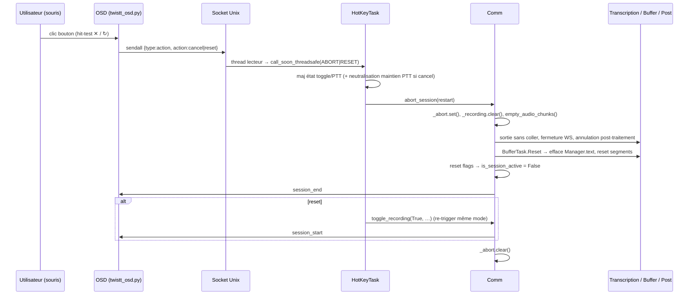

# Boutons Annuler / Réinitialiser dans l'overlay OSD

**Date :** 2026-06-28
**Statut :** design validé (sémantique + architecture + UI), en attente de plan d'implémentation

## 1. Contexte et problème

L'overlay OSD (`twistt_osd.py`) est désormais *click-through* (input region vide sur la
`GdkSurface`). Il affiche en temps réel le spectre audio, le texte transcrit (*Speech*),
le post-traitement (*Post-treatment*) et un indicateur d'état.

Aujourd'hui une session de transcription ne peut s'arrêter que de deux façons :
- relâchement de la touche / re-appui en mode toggle → **fin normale** qui colle le résultat ;
- crash WebSocket ou arrêt de l'app (SIGINT).

Il n'existe **aucune notion d'annulation** en cours de session. L'utilisateur veut pouvoir,
depuis l'overlay et à la souris (sa touche toggle/PTT est mappée sur un bouton de souris) :
- **Annuler** une transcription en cours (l'effacer entièrement et couper le mode actif) ;
- **Réinitialiser** une transcription (l'effacer et repartir immédiatement dans le même mode).

## 2. Sémantique cible

| Action | Efface tout (indicateur + texte déjà collé) | Coupe le mode actif | Relance dans le même mode |
|---|:--:|:--:|:--:|
| **Annuler** ✕ | ✓ | ✓ | — |
| **Réinitialiser** ↻ | ✓ | ✓ | ✓ |

Autrement dit : **`Réinitialiser = Annuler + re-trigger`**.

Détails par mode :
- **Toggle** — *Annuler* éteint le toggle (comme un re-appui d'arrêt). *Réinitialiser* éteint
  puis ré-arme le toggle, l'écoute reprend mains libres.
- **Push-to-talk (PTT)** — le bouton physique reste enfoncé pendant le clic souris.
  *Annuler* doit **neutraliser ce maintien** jusqu'au prochain appui (sinon l'enregistrement
  repartirait tout seul). *Réinitialiser* repart immédiatement et continue tant que le bouton
  reste maintenu.

« Efface tout » = retour à l'état initial du curseur : l'indicateur `" (Twistting...)"` **et**
tout texte déjà collé (mode batch streaming, ou texte brut du mode post-correct) sont retirés.

## 3. Interface (UI)

- **Emplacement :** coin **bas-droite** de l'overlay (symétrique de l'indicateur d'état qui est
  en bas-gauche ; ne recouvre pas le spectre). Deux pastilles côte à côte : **↻ Réinitialiser**
  puis **✕ Annuler** (la croix à l'extrême bord).
- **Apparence :** pastilles arrondies (~27 px), fond translucide, icônes vectorielles dessinées
  en Cairo (flèche circulaire pour reset, croix pour cancel). Cohérent avec le rendu existant.
- **Pas de retour de survol en v1** (clic seul) : un `Gtk.GestureClick` suffit, pas de
  `GestureMotion`. Un éventuel flash de confirmation au clic est hors périmètre v1.
- **Visibilité :** les boutons ne sont présents que lorsqu'une session est active
  (`text_state.session_active`). Quand ils sont absents, l'overlay reste 100 % click-through.

Maquette de référence : `osd-buttons-mockup/` (artifacts de la session de design).

## 4. Architecture — 4 briques

### Brique 1 — Boutons cliquables sur un overlay click-through

Fichier : `twistt_osd.py` (`OSDRenderer`, `OSDWindow`).

- **Géométrie partagée :** une fonction calcule les rectangles des 2 boutons à partir de la
  taille de la fenêtre (ancrage bas-droite, marges fixes). Utilisée à la fois pour le dessin
  et pour le hit-test / l'input region (source unique de vérité).
- **Dessin :** ajouter le rendu des 2 boutons dans `OSDRenderer.draw()` après l'indicateur
  d'état, uniquement si `session_active`.
- **Input region :** au lieu d'une région vide, définir l'input region de la `GdkSurface` =
  **union des 2 rectangles** quand les boutons sont visibles, vide sinon. Recalculée lorsque
  l'état d'affichage change (passage session active/inactive) et à chaque `map`.
- **Clic :** un `Gtk.GestureClick` sur la `DrawingArea`. Dans le handler, hit-test (x, y) →
  bouton `cancel` ou `reset` → envoi de la commande au process principal (Brique 2).

### Brique 2 — Canal de retour OSD → process principal

Le socket Unix `~/.local/share/twistt/osd.sock` est déjà full-duplex ; seul le sens retour
(applicatif) manque.

- **Côté OSD (serveur) :** réutiliser `OSDProtocol.encode_message()` et émettre via
  `self._client_conn.sendall(...)` un message `{"type": "action", "action": "cancel"|"reset"}`.
  Le socket accepté est non-bloquant — prévoir un envoi robuste (passer la socket en bloquant
  pour l'envoi, ou bufferiser ; messages courts et rares).
- **Côté main (client) :** ajouter dans `OsdRunner` un **thread lecteur** sur `self._socket`
  qui décode les frames (même framing longueur 4 octets big-endian + JSON) et route l'action
  vers la boucle asyncio via `loop.call_soon_threadsafe(...)`. Lecture (thread) et écriture
  (`send_message`, boucle asyncio) sur le même socket sont sûres car full-duplex.
- **Nouveau type de message** (sens OSD → main) : `action` avec valeurs `cancel` / `reset`.
  Les types existants (sens main → OSD) sont inchangés.

### Brique 3 — Routing dans `HotKeyTask` (cohérence d'état toggle/PTT)

Fichier : `twistt.py` (`HotKeyTask.run`, ~2520).

L'état toggle/PTT (`hotkey_pressed`, `is_toggle_mode`, `active_hotkey`, `toggle_stop_time`) est
**local à la boucle `run()`**. Une commande venue de l'overlay doit donc traverser cette boucle,
pas court-circuiter `Comm`, sous peine de désynchroniser la machine à états (et de casser le PTT).

- L'action reçue (Brique 2) est injectée comme **item synthétique** (`ABORT` / `RESET`) dans
  `HotKeyTask._event_queue` (via `call_soon_threadsafe`).
- `run()` gagne une branche dédiée qui, selon le mode courant :
  - **Annuler en toggle :** `is_toggle_mode=False`, `active_hotkey=None`, `hotkey_pressed=False`,
    pose `toggle_stop_time=now` (cooldown anti-rebond) ; appelle `comm.abort_session(restart=False)`.
  - **Annuler en PTT :** pose un flag local `ptt_aborted` ; **ignore** les événements de
    `active_hotkey` jusqu'à son `KEY_UP`, puis remet l'état à zéro ; appelle
    `comm.abort_session(restart=False)`.
  - **Réinitialiser en toggle :** `abort_session(restart=False)` puis re-arme via
    `comm.toggle_recording(True, name, True)` (en contournant le cooldown, car re-trigger interne).
  - **Réinitialiser en PTT :** `abort_session(restart=False)` puis
    `comm.toggle_recording(True, name, False)` ; `hotkey_pressed`/`active_hotkey` restent posés,
    la session continue jusqu'au relâchement physique.
- Si aucune session n'est active au moment du clic, l'action est ignorée (no-op).

### Brique 4 — Abort coordonné du pipeline (`comm.abort_session(restart)`)

Fichier : `twistt.py` (`Comm`, tâches transcription, `BufferTask`, `PostTreatmentTask`, `OsdTask`).

Mécanisme **coopératif** via un `asyncio.Event _abort` (pas de `task.cancel()` brutal, qui
sèmerait des `CancelledError` dans des sous-tâches locales à `_run_session`).

Séquence d'abort :
1. `comm._abort.set()` — signal global.
2. `comm._recording.clear()` + `comm.empty_audio_chunks()` — stoppe l'écoute et jette l'audio.
3. **Transcription :** `_run_session` (~2850), `_sender`, `_receiver` surveillent `_abort` →
   sortent sans appeler `_queue_full_mode_result` (deux sites : base ~2873 et override Mistral
   ~3552) et ferment le WebSocket. Tant que
   `_abort` est posé, `_handle_new_delta` / `_handle_done_segment` n'émettent plus de nouvel output.
4. **Post-traitement :** étendre le `request_speculative_cancel()` existant (~2227) au cas
   non-spéculatif (réutiliser le même `cancel_check` dans `_post_process`, ~3806) pour stopper un
   streaming LLM en vol.
5. **Effacement du texte déjà collé :** nouveau command `BufferTask.Commands.Reset` traité par
   `BufferTask.Manager` : émet la suppression de tout `Manager.text` (backspaces sur sa longueur,
   en s'appuyant sur le miroir exact de ce qui est dans l'app cible), puis remet à zéro
   `Manager.text`, `segments`, `segment_order`, `cursor`. Couvre indicateur + transcript + post.
6. **Reset des états :** `_is_session_finishing=False`, `is_speech_active=False`,
   `is_post_treatment_active=False`, etc. → `is_session_active` repasse à False.
7. **Notification OSD :** `session_end` (Annuler). Pour *Réinitialiser*, le re-trigger de la
   Brique 3 ré-émet un `session_start`.
8. `comm._abort.clear()` une fois la séquence terminée (avant tout éventuel re-trigger).

## 5. Flux (séquence d'abort)

## 6. Risques et points de synchronisation (à verrouiller au plan)

1. **Ordonnancement du `Reset` vs sorties déjà émises (risque n°1).**
   `_buffer_commands` est une `asyncio.PriorityQueue` triée par `seq_num`, et le `Manager.text`
   ne reflète que ce que le `Manager` a **émis** vers `OutputTask`. Il faut garantir que le
   `Reset` s'exécute **après** toute insertion déjà en file et **après** que `OutputTask` ait
   tapé ce qui était en queue, pour que les backspaces correspondent exactement à l'écran réel.
   Stratégies candidates : `seq_num` maximal pour le `Reset` ; et/ou cesser d'émettre de nouveaux
   inserts dès `_abort`, laisser drainer, puis poser le `Reset`. À trancher et tester finement.
2. **Course sur les deltas en vol.** Des événements WebSocket peuvent arriver après `_abort.set()`.
   Le court-circuit dans `_handle_new_delta` / `_handle_done_segment` doit être posé avant le reset
   des flags pour ne pas réinsérer de texte.
3. **Re-trigger et cooldown toggle.** Le re-trigger interne de *Réinitialiser* doit contourner le
   `toggle_cooldown` (0,5 s) et le garde `is_session_active` (qui bloque un nouveau DOWN tant que
   le pipeline tourne) — d'où l'importance que `abort_session` ait bien ramené `is_session_active`
   à False avant le re-trigger.
4. **Sécurité du socket retour.** Émission sur une socket non-bloquante côté OSD ; gérer un envoi
   partiel / `BlockingIOError` (messages courts, mais robustesse requise).
5. **Reconnexion socket côté lecture.** `OsdRunner.send_message` **remplace** `self._socket` par
   une nouvelle connexion en cas d'erreur d'envoi. Un thread lecteur lié à l'ancien objet socket
   lirait alors un descripteur mort. Le lecteur doit donc se re-lier au socket courant sur
   reconnexion (ne pas capturer une référence figée), ou être recréé en même temps que le socket.

## 7. Cas particuliers

- **Mode output `none` :** rien n'est collé → `Reset` = no-op clavier, on ne fait que remettre
  les états à zéro.
- **Mode `full` :** si l'abort survient avant le collage final, il n'y a rien à effacer (hors
  indicateur) ; sinon `Manager.text` couvre le cas.
- **Mode `post-correct` :** le texte brut déjà collé est dans `Manager.text` → effacé normalement.
- **Limite connue (inchangée) :** l'effacement suppose que le curseur est resté en fin de zone
  insérée — comme l'indicateur et le post-correct actuels. Si l'utilisateur a cliqué/tapé
  ailleurs entre-temps, l'effacement peut déraper. On ne dégrade pas l'existant.

## 8. Composants touchés

- `twistt_osd.py` : `OSDRenderer.draw` (+ rendu boutons), géométrie des boutons, `OSDWindow`
  (input region dynamique, `GestureClick`, hit-test), envoi retour via `_client_conn`.
- `twistt.py` :
  - `OsdRunner` : thread lecteur du socket + routage vers la boucle.
  - `HotKeyTask.run` : branche `ABORT`/`RESET`, gestion état toggle/PTT, re-trigger.
  - `Comm` : `abort_session(restart)`, `_abort` Event, extension du cancel post-traitement.
  - Tâches transcription (`BaseTranscriptionTask._run_session`, `_sender`, `_receiver`,
    `_handle_new_delta`, `_handle_done_segment`, `_queue_full_mode_result`) : surveillance `_abort`.
  - `BufferTask` + `Manager` : command `Reset`.
  - `PostTreatmentTask` : prise en compte du cancel non-spéculatif.
  - `OsdTask` : notifications `session_end` / `session_start` cohérentes.

## 9. Plan de test manuel

Pour chaque mode (toggle / PTT) et chaque output mode (batch, full, none, post-correct) :
1. **Annuler en cours d'enregistrement** : le texte (et l'indicateur) disparaît entièrement,
   le mode s'arrête ; en PTT, vérifier qu'on ne repart pas tout seul tant que le bouton est
   maintenu, et qu'un nouvel appui redémarre normalement.
2. **Annuler pendant le post-traitement** (touche déjà relâchée) : le streaming LLM s'arrête,
   le texte est effacé, la session se termine proprement.
3. **Réinitialiser en cours** : le texte est effacé et l'écoute reprend immédiatement dans le
   même mode (toggle ré-armé / PTT continue tant que maintenu).
4. **Clics répétés / rapides** : pas de session fantôme, pas de texte résiduel, pas de blocage
   (`is_session_active` revient bien à False).
5. **Click-through** : hors des 2 boutons, les clics traversent toujours l'overlay ; entre deux
   sessions (boutons absents), tout l'overlay est traversant.

## 10. Hors périmètre (YAGNI)

- Retour visuel de survol (hover) sur les boutons.
- Raccourci clavier d'annulation (on passe par l'overlay / la souris).
- Annulation « partielle » (revenir N segments en arrière) — on efface tout.
- Persistance / historique des transcriptions annulées.
